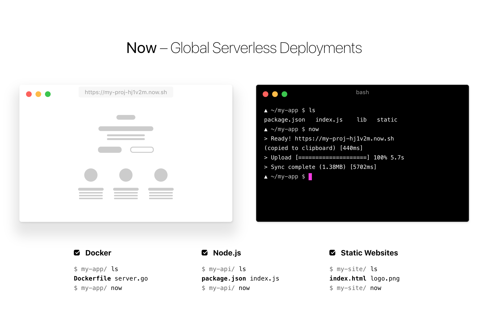

## Intro

Scott Mueller

smueller.tampa.ai@gmail.com

MomsSafetyNet.com
---
## Tampa.ai

Looking for Presenters

---
# Deploying Deep Learning Models
---
* "Brilliant" Deep Learning Idea
* Built initial Model
> Minimum Viable Product
* What could go wrong
* Deployment Alternatives
* Choices
* Example Project

---
## We'll Focus on smaller scale project

* Websites
* Low-volume Services

> Higher-scale --> Resources to solve that challenge
---
## Normal Father-Son Activities


---
## Data Science Father-Son

---
## Fast.ai v3

---
## Good Friends

---
## Fast.ai Lessons

*
[What was important about Fast.ai for Zach]
---
## Is it Venemous?


---
## Gathering Data
[Image Download snippet]
---
## Clean up Data
[Something related to cleaning up date]
---
## CollabNet
[Picture of Notebook]
---
## Incorrectly Classified
[Picture of Incorrect Matrix]
---
## Good Accuracy
[Picture of accuracy]
---
## Let's Build a Website

---
## What could go wrong?

* Misidentification
* Linked to Bank Account
* Obtain some business value
* Security of application
---
## Model is just a function


> Inputs, Processing, Result
---
## Inference

---
## Example Inference Code

```python
pred_class,pred_idx,outputs = learn.predict(img)
pred_class
```

```python
'black'
```
---
## Architectures for Function Calls

* Remote Procedure Calls
* SOAP requests
* JSON Service
* Web Socket Communication
* Serverless
---
## Why Distributed?

* Deep Neural Nets use lots of Memory
* Lots of simple math function calls
* Slows down your web server when scaling model calls
---
## To GPU or not to GPU?

* Latency impact on business
* Sustained concurrent usage

---
## Remote Function Calls
---
## Serverless



https://zeit.co/
---

---
## Flask Server

* Simple Python Server


http://flask.pocoo.org/]
---
Productionizing Flask


https://vsupalov.com/flask-web-server-in-production/

---
## Remote communication via JSON

* Security
* Denial of Service Attack Robustness
* Direct Service Access by 3rd Party 
---
## Distributed Procedure Call
```elixir
  @doc """
  Call python function using MFA format
  """
  def call_python(pid, module, function, arguments \\ []) do
    pid
    |>:python.call(module, function, arguments)

  end
```
---
## Example Applications

https://github.com/nikhilno1/healthy-or-not/blob/master/heroku-deploy.md

https://github.com/dzlab/deepprojects/tree/master/emotion-classifier

https://hackernoon.com/anothernothotdog-280ee5b86fb3

https://github.com/keyurparalkar/ASL-live-predictor

---

https://medium.com/@lankinen/fastai-model-to-production-this-is-how-you-make-web-app-that-use-your-model-57d8999450cf

https://github.com/etown/dl1/blob/master/face/README.md

https://github.com/EdwardJRoss/whatcar

https://medium.com/datadriveninvestor/building-a-cold-or-canker-sores-classifier-app-using-deep-learning-242b8c80fbe5

https://github.com/tamlyn/treeid


---
## Optimization

* Latency vs Accuracy
* Cost vs Accuracy at medium scale
---
## Distillation

- Train accurate, complex model

- Train a simpler model from complex model
---


https://medium.com/neural-machines/knowledge-distillation-dc241d7c2322

---
Questions?
---
## Study Group

https://ai-tampa-study-group.github.io/meetings/

---

[MomsSafetyNet.com](https://www.momssafetynet.com/team.html)

Looking for Founder Engineers

Elixir, Functional Programming, Rails, Experience

Web presentation skills